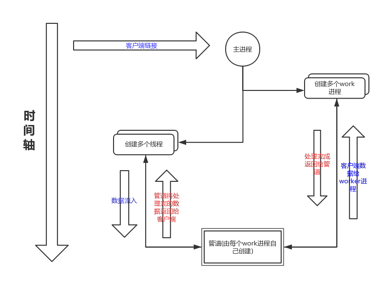

# Swoole内部实现

swoole源码阅读与模拟练习的总结

## 整体流程

## 目录

* [Introduction](README.md)
* [第一章 概述](第一章概述.md)
* [第二章 server启动流程](第二章server启动流程.md)
* [第三章 连接调用流程](第三章连接调用流程.md)
* [第四章 reactor线程逻辑](第四章reactor线程逻辑.md)
* [附1:Swoole与php交互](append/F1_Swoole与php交互.md)
* [附2:tinys项目](append/F2_tinys项目.md)
* [附3:基础知识](append/F3_基础知识.md)

gitbook地址 [https://wosiwo.gitbooks.io/swoole/content/](https://wosiwo.gitbooks.io/swoole/content/)

项目地址 [https://github.com/wosiwo/tinys](https://github.com/wosiwo/tinys)

